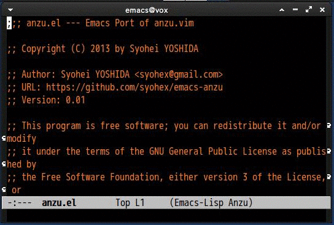
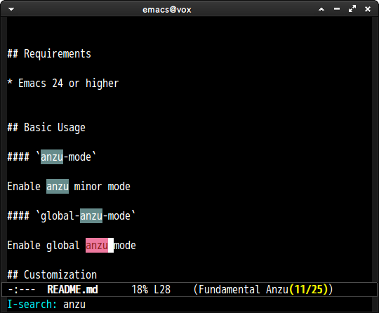
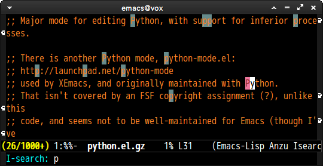

# anzu.el

[![melpa badge][melpa-badge]][melpa-link]
[![melpa stable badge][melpa-stable-badge]][melpa-stable-link]
[![gh actions badge][gh-actions-badge]][gh-actions-link]

## Introduction

`anzu.el` is an Emacs port of [anzu.vim](https://github.com/osyo-manga/vim-anzu).
`anzu.el` provides a minor mode which displays *current match* and *total matches*
information in the mode-line in various search modes.

## New Maintainer

This package has a new maintainer as of March 2020, and based on the
valuable contribution of insights and fixes from the author, you
should see issues from years past are now getting resolved.  You may
also see instability in the short term.  Please bear with us!

## Screenshot




## Requirements

- Emacs 24 or higher
- `cl-lib` 0.5 or higher (you don't need to install `cl-lib` if you use Emacs 24.3 or higher)


## Installation

You can install `anzu.el` from [MELPA](https://melpa.org/) with `package.el`

```
 M-x package-install anzu
```


## Basic Usage

##### `global-anzu-mode`

Enable global anzu mode:

```lisp
(global-anzu-mode +1)
```

##### `anzu-mode`

Enable anzu minor mode:

```lisp
(anzu-mode +1)
```

##### `anzu-query-replace`

Same as `query-replace` except displays anzu information in the
mode-line.

##### `anzu-query-replace-regexp`

Same as `query-replace-regexp` except displays anzu information in the
mode-line.


You can replace key bindings for the standard definitions of
`query-replace` and `query-replace-regexp` with their anzu versions by
adding this snippet to your configuration:

```lisp
(global-set-key [remap query-replace] 'anzu-query-replace)
(global-set-key [remap query-replace-regexp] 'anzu-query-replace-regexp)
```

##### `anzu-query-replace-at-cursor`

Works like `anzu-query-replace` except the *from-string* is the symbol
at the cursor.

##### `anzu-query-replace-at-cursor-thing`

Works like `anzu-query-replace-at-cursor` except the replacement is
constrained to the region specified by the variable
`anzu-replace-at-cursor-thing`.  See the variable's description in
the customization section for additional details.

Be careful not to confuse this variable with the identically named
function (see below).

##### `anzu-replace-at-cursor-thing`

Like `anzu-query-replace-at-cursor-thing`, but doesn't query for
confirmation before making the substitution.

Be careful not to confuse this function with the identically named
customization variable.  See the discussion in the
`anzu-query-replace-at-cursor-thing` section.


##### `anzu-isearch-query-replace`

The anzu version of `isearch-query-replace`.

##### `anzu-isearch-query-replace-regexp`

The anzu version of `isearch-query-replace-regexp`.

## Customization

##### `anzu-mode-line`

Face of mode-line anzu information

##### `anzu-mode-line-no-match`

Face of mode-line at no matching case

##### `anzu-replace-highlight`

Face of from-string of replacement

##### `anzu-replace-to`

Face of to-string of replacement

##### `anzu-mode-line-update-function`

Function which constructs mode-line string. anzu.el puts its output to mode-line. It is called at searching, inputting replaced word, replacing. This must be non-nil.

The function takes 2 integer arguments, current position and total match number. You can get current-state from `anzu--state`(`'search`, `'replace-query`, `replace`).

```lisp
(defun my/anzu-update-func (here total)
  (when anzu--state
    (let ((status (cl-case anzu--state
                    (search (format "<%d/%d>" here total))
                    (replace-query (format "(%d Replaces)" total))
                    (replace (format "<%d/%d>" here total)))))
      (propertize status 'face 'anzu-mode-line))))

(custom-set-variables
 '(anzu-mode-line-update-function #'my/anzu-update-func))
```

##### `anzu-cons-mode-line-p`(Default is `t`)

Set `nil` if you want to display anzu information at any position in mode-line.
`anzu.el` cons search information head of `mode-line` as default.

For example, show search information tail of `minor-mode-alist`

```lisp
(setq anzu-cons-mode-line-p nil)
(setcar (cdr (assq 'isearch-mode minor-mode-alist))
        '(:eval (anzu--update-mode-line)))
```

##### Screenshot




##### `anzu-mode-lighter`

Mode name in `mode-line`. Default is ` Anzu`.


##### `anzu-input-idle-delay`(Default is `0.05`)

Delay second of updating mode-line information when you input from-string

##### `anzu-regexp-search-commands`

Commands which have regexp input. If the last command is a member of this list,
`anzu.el` treats input as regular expression.

The default value is `'(isearch-forward-regexp isearch-backward-regexp)`.

##### `anzu-use-migemo`(Default is `nil`)

Set to `t` if you use [migemo](https://github.com/emacs-jp/migemo).

##### `anzu-search-threshold`(Default is `nil`)

Threshold of searched words. If there are searched word more than this value,
`anzu.el` stops to search and display total number like `1000+`(as default).
If this value is `nil`, `anzu.el` counts all words.



##### `anzu-replace-threshold`(Default is `nil`)

Threshold of replacement overlay. If this value is `nil`,

##### `anzu-minimum-input-length`(Default is 1)

Minimum input length to enable anzu. This parameter is useful for `migemo` users.
Searching 1 or 2 characters with `migemo` is too heavy if buffer is so large.
Please set 3 or higher if you frequently edit such file.

##### `anzu-deactivate-region`(Default is `nil`)

Deactivate region at anzu replace command if this value is non-nil.
It is hard to see with anzu replace command when region is active.

##### `anzu-replace-at-cursor-thing`(Default is 'defun)

Describes the type of *thing* used by the `anzu-*-thing` functions.
It can be set to any symbol that is a valid argument for the
`thing-at-point` function, including e.g.  `defun`, `word`, and
`page`.  See the documentation for `thing-at-point` for additional
information.

##### `anzu-replace-to-string-separator`(Default is "")

Separator of `to` string.


## Sample Configuration

```lisp
(require 'anzu)
(global-anzu-mode +1)

(set-face-attribute 'anzu-mode-line nil
                    :foreground "yellow" :weight 'bold)

(custom-set-variables
 '(anzu-mode-lighter "")
 '(anzu-deactivate-region t)
 '(anzu-search-threshold 1000)
 '(anzu-replace-threshold 50)
 '(anzu-replace-to-string-separator " => "))

(define-key isearch-mode-map [remap isearch-query-replace]  #'anzu-isearch-query-replace)
(define-key isearch-mode-map [remap isearch-query-replace-regexp] #'anzu-isearch-query-replace-regexp)
```

[melpa-link]: https://melpa.org/#/anzu
[melpa-stable-link]: https://stable.melpa.org/#/anzu
[gh-actions-link]: https://github.com/emacsorphanage/anzu/actions
[melpa-badge]: https://melpa.org/packages/anzu-badge.svg
[melpa-stable-badge]: https://stable.melpa.org/packages/anzu-badge.svg
[gh-actions-badge]: https://github.com/emacsorphanage/anzu/workflows/ci-checks/badge.svg
